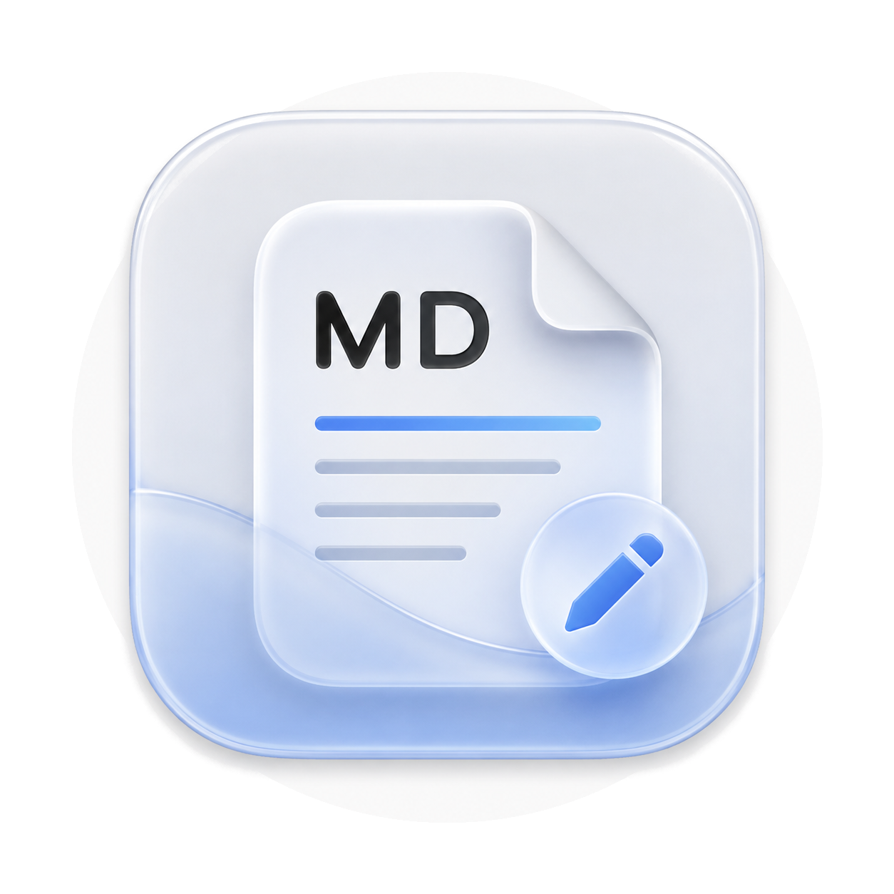

# MDPreview (v1.1.0)

<p align="center">
  
</p>

<p align="center">
  <strong>100% 纯原生 macOS 极简 Markdown 阅读与编辑器</strong><br>
  <em>Zero WebKit Overhead · Apple Native Engine · Liquid Glass Modern HIG · Document-Based Multi-Window</em>
</p>

<p align="center">
  
  
  
  
  
</p>

---

## 📖 项目简介 (Introduction)

**MDPreview** 是一款完全采用 Apple 原生技术栈构建的 macOS 极简 Markdown 文档阅读器与轻量编辑器。

不同于市面上常见的基于 Electron 或 WebKit (HTML/JS) 渲染的 Markdown 工具，MDPreview 彻底摒弃了庞大的 Web 容器，基于 **`apple/swift-markdown`** 语法树、**`TextKit 2`** 与 **`SwiftUI NavigationSplitView / DocumentGroup`** 原生文档型架构打造，并在 macOS 26+ 上拥抱 **Liquid Glass** 流体视觉设计。

* **极致轻量**：纯原生绘制，无 WebKit 渲染进程，资源占用远低于 Electron / 浏览器内核方案。
* **丝滑渲染**：原生组件树与 CoreText 排印，ProMotion 平滑滚动与选区。
* **原生体验**：深度整合 macOS 窗口系统、多标签页（Multi-Tab）、文件关联（Open With）、拖拽交互与系统快捷键。

---

## ✨ 核心特性 (Features)

### 1. 🚀 纯原生渲染引擎 (Zero WebKit Overhead)
- 基于 Apple 官方 **`swift-markdown` (cmark-gfm AST)** 引擎进行底层解析。
- 无需 Chromium / WebKit 渲染进程，告别卡顿与发热，极大降低系统资源开销。
- AST → 类型安全的块级模型 → SwiftUI 原生组件树，带解析结果缓存与后台解析防抖。

### 2. 🗂️ 原生文档架构与多标签页 (Document-Based Multi-Window & Tabs)
- 采用 SwiftUI 原生 `DocumentGroup` 架构，与 macOS 系统深度契合。
- 支持在 Finder 中右键任意 `.md` 文件选择「打开方式 → MDPreview」精准独立加载。
- 每次打开新文件或按 `⌘O` / `⌘N`，自动在独立新窗口或新 Tab 中呈现，互不干扰。
- 完整支持 macOS 原生标签页合并（Merge All Windows）与窗口拆分。

### 3. 🎨 Liquid Glass 现代美学与统一原生工具栏
- macOS 26+ 采用系统原生流体玻璃材质（`.glassEffect`）；macOS 14 / 15 自动回退 `.ultraThinMaterial` 毛玻璃。
- **Preview（预览.app）风格联动布局**：侧边栏展开时文档标题对齐主内容区上方；收起时平滑跟随左上角按钮。
- **居中分段控制器**：顶部工具栏正中提供紧凑的「阅读 / 编辑 / 分屏」三模切换。

### 4. 📑 智能目录大纲 (TOC Sidebar)
- 自动提取文档中 `H1` ~ `H6` 标题层级，生成清晰的目录树，可逐级折叠。
- 接入系统原生 `NavigationSplitView`，侧边栏快捷折叠 / 展开（`⌘⌥S`），点击平滑滚动定位正文。
- **滚动联动**：阅读时正文滚动，侧边栏自动高亮当前所在章节。
- 引用块 / 列表内部的 `#` 标题不会污染大纲层级。

### 5. ⚡️ 阅读 / 编辑 / 分屏三模秒切
- **📖 纯净阅读模式**：原生富文本展示，支持标题（含行内样式）、`==高亮==`、加粗 / 斜体 / 删除线 / 行内代码、链接、引用块、有序 / 无序 / 嵌套列表、任务清单、表格、分割线、块级图片（本地与远程）。
- **✏️ 原生编辑模式**：基于 **TextKit 2 (`NSTextView`)**，输入法组字与撤销栈受保护，双向实时同步。
- **🪟 左右分屏模式**：左侧即时编辑，右侧实时渲染预览。

### 6. ✅ 可交互任务清单 (Task Lists)
- 阅读模式下直接勾选复选框，改动**回写到源 Markdown 文档**（按源码行定位）。

### 7. 💻 原生代码语法高亮 (Syntax Highlighting)
- 内置针对 Swift、Python、JavaScript / TypeScript、JSON、Shell、Rust、Go 的纯原生轻量着色引擎。
- 圆角浅底代码容器，带语言标签与一键复制。

### 8. 🔍 悬浮状态胶囊 (Floating Glass Capsule)
- 右下角常驻显示当前文档字数（中文按字、拉丁按词计）。
- 鼠标悬停时展开显示行数；静止时降低存在感，不打扰阅读焦点。

### 9. 📂 Finder 深度整合与拖拽支持
- 支持将本地 `.md` 文件拖入窗口即可打开。
- 原生文件关联：`.md`、`.markdown`、`.mdown`、`.mkdn` 等。

---

## 🗺️ 版本规划 (Roadmap)

### ✅ v1.1.0 — 正确性与构建（当前版本）

- **编辑器**：改用 TextKit 2 装配；编辑 / 输入法组字期间不再回灌文本，修复中文输入掉字、光标跳动、撤销栈丢失。
- **解析正确性**：嵌套 / 多段落列表项、标题内联样式保留、`==高亮==` 正则化（不再误伤 `a == b`）、引用块内标题不进 TOC、块级图片渲染。
- **交互**：任务列表勾选回写源文档；TOC 滚动联动高亮；按键防抖解析（大文档后台线程）。
- **工程**：独立 `MDPreview.xcodeproj`（XcodeGen 生成）；`swift-markdown` 锁定到具体 commit 并提交 `Package.resolved`；swift-testing 单测；GitHub Actions CI；DMG 移出仓库改走 Releases。

### 🚧 v1.2.0 — 阅读与编辑体验（规划中）

1. **偏好设置**：`Settings` 场景 + `@AppStorage`，可调正文字号（`⌘+` / `⌘-` / `⌘0`）、行距、版心宽度、等宽字体、主题（跟随系统 / 浅色 / 深色）。
2. **编辑器升级**：行号标尺、编辑态 Markdown 源码语法高亮、当前行高亮。
3. **文档内查找 `⌘F`**：阅读态跨块查找 + 命中高亮 + 上一处 / 下一处跳转（编辑态复用系统 Find Bar）。
4. **导出 PDF / 打印 `⌘P`**：基于 `NSHostingView` 的矢量渲染，处理代码块 / 表格 / 图片分页。

### 🔭 v1.3.0 及以后

- 外部修改静默热重载（`DispatchSourceFileSystemObject` 监听 Finder 改动）
- Finder Quick Look 快速预览插件（独立 `.appex`）
- 段落中间的行内图片、数学公式（LaTeX）
- 更强的代码高亮（多行字符串 / 嵌入语言）
- 无障碍（Dynamic Type / VoiceOver）与英文本地化

---

## ⌨️ 常用快捷键 (Keyboard Shortcuts)

| 快捷键 | 功能说明 |
| :--- | :--- |
| `⌘ R` | 切换至阅读模式 (Reader View) |
| `⌘ E` | 切换至编辑模式 (Editor View) |
| `⇧ ⌘ E` | 切换至分屏模式 (Split View) |
| `⌘ ⌥ S` | 展开 / 收起目录大纲侧边栏 |
| `⌘ N` | 新建文档窗口 / Tab |
| `⌘ O` | 打开本地 Markdown 文件 |
| `⌘ S` | 保存当前文档 |
| `⌘ ⇧ S` | 另存为新文件 |
| `⌘ W` | 关闭当前窗口 / 标签页 |
| `⌘ Q` | 退出应用程序 |

---

## 🛠️ 系统要求 (System Requirements)

- **运行**：macOS 14.0 (Sonoma) 或更高版本（Liquid Glass 材质需 macOS 26+，低版本自动回退毛玻璃）。
- **硬件平台**：Apple Silicon 及 Intel。
- **开发**：完整版 Xcode 16+（Swift 6）与 [`xcodegen`](https://github.com/yonaskolb/XcodeGen)。

---

## 📦 安装与编译构建 (Installation & Build)

### 方式一：使用 DMG 安装包 (Recommended)
1. 从 [Releases](https://github.com/TonyT1226/md-reader/releases) 页面下载 **`MDPreview.dmg`**。
2. 双击打开，将 **`MDPreview.app`** 拖入 **`Applications`** 文件夹。
3. 双击运行，或在任意 `.md` 文件右键「打开方式 → MDPreview」。

### 方式二：从源码构建

```bash
git clone https://github.com/TonyT1226/md-reader.git
cd md-reader

# 只跑解析核心 + 单测（需完整 Xcode 工具链）
swift test

# 生成并打开 App 工程
brew install xcodegen
xcodegen generate
open MDPreview.xcodeproj      # 在 Xcode 里 Run / 预览 / 归档

# 或命令行打包 DMG
./package_app.sh
```

> 详见 [CONTRIBUTING.md](CONTRIBUTING.md)。若遇到 “no such module 'Testing'”、SwiftUI
> 预览无法加载、运行后不开窗，通常是 `xcode-select` 指向了 Command Line Tools，
> 执行 `sudo xcode-select -s /Applications/Xcode.app/Contents/Developer` 即可。

---

## 📄 开源许可 (License)

本项目采用 [MIT License](LICENSE) 开源协议。
