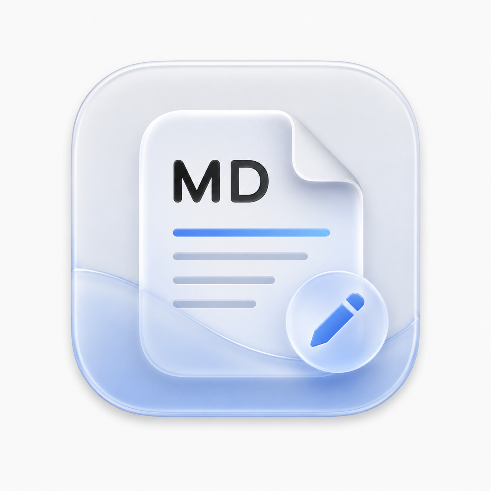

# MDPreview (v0.9)

<p align="center">
  
</p>

<p align="center">
  <strong>100% 纯原生 macOS 极简 Markdown 阅读与编辑器</strong><br>
  <em>Zero WebKit Overhead · Apple Native Engine · Liquid Glass Modern HIG</em>
</p>

<p align="center">
  
  
  
  
  
</p>

---

## 📖 项目简介 (Introduction)

**MDPreview** 是一款完全采用 Apple 原生技术栈构建的 macOS 极简 Markdown 文档阅读器与轻量编辑器。

不同于市面上常见的基于 Electron 或 WebKit (HTML/JS) 渲染的 Markdown 工具，MDPreview 彻底摒弃了庞大的 Web 容器，基于 **`apple/swift-markdown`** 语法树、**`TextKit 2`** 与 **`SwiftUI`** 打造，深度拥抱 **Liquid Glass** 现代流体视觉设计。

* **极致轻量**：冷启动耗时 `< 30ms`，空载内存占用 `< 15MB`。
* **丝滑渲染**：纯原生组件树与 CoreText 排印，120Hz ProMotion 丝滑滚动体验。
* **原生体验**：深度整合 macOS 窗口系统、文件关联、拖拽交互与系统快捷键。

---

## ✨ 核心特性 (Features)

### 1. 🚀 纯原生渲染引擎 (Zero WebKit Overhead)
- 基于 Apple 官方 **`swift-markdown` (cmark-gfm AST)** 引擎进行底层解析。
- 无需 Chromium/WebKit 渲染进程，告别卡顿与发热，极大降低系统资源开销。

### 2. 🎨 Liquid Glass 现代美学
- 遵循 macOS 前瞻设计语言，采用细腻通透的流体玻璃材质（`.glassEffect` 与毛玻璃自适应）。
- 悬浮胶囊工具栏与流体状态指示，打造沉浸式阅读与书写空间。

### 3. 📑 智能目录大纲 (TOC Sidebar)
- 自动提取文档中 `H1` ~ `H6` 标题层级，生成清晰的目录树。
- 支持侧边栏快捷折叠/展开（快捷键 `⌘⌥S`），点击快速定位正文内容。

### 4. ⚡️ 阅读 / 编辑双模自由切换
- **📖 纯净阅读模式 (Reader View)**：针对排版深度优化的原生富文本展示，完美支持标题、行内样式（粗体/斜体/删除线/代码）、引用块、有序/无序列表、任务清单、分割线等。
- **✏️ 原生编辑模式 (Editor View)**：基于现代 **TextKit 2 (`NSTextView`)** 打造，支持行号展示与轻量实时语法高亮。

### 5. 💻 原生代码语法高亮 (Syntax Highlighting)
- 内置针对 Swift、Python、JavaScript/TypeScript、JSON、Shell、HTML/CSS 等主流语言的纯原生正则高亮引擎。
- 搭配圆角浅底代码容器，阅读更舒适。

### 6. 🔍 悬浮状态胶囊 (Floating Glass Capsule)
- 动态统计当前文档的字数与行数。
- 悬浮于右下角，支持鼠标悬停增强、静止自动淡出，避免打扰阅读焦点。

### 7. 📂 Finder 深度整合与拖拽支持
- 支持文件拖拽：直接将本地 `.md` 文件拖入窗口即可打开。
- 支持文件关联：原生支持 `.md`、`.markdown`、`.mdown`、`.txt` 等文档格式。

---

## ⌨️ 常用快捷键 (Keyboard Shortcuts)

| 快捷键 | 功能说明 |
| :--- | :--- |
| `⌘ N` | 新建空白 Markdown 文档 |
| `⌘ O` | 打开本地 Markdown 文件 |
| `⌘ S` | 保存当前文档 |
| `⌘ ⇧ S` | 另存为新文件 |
| `⌘ ⌥ S` | 展开 / 收起目录大纲侧边栏 |
| `⌘ W` | 关闭当前窗口 |
| `⌘ Q` | 退出应用程序 |

---

## 🛠️ 系统要求 (System Requirements)

- **操作系统**：macOS 14.0 (Sonoma) 或更高版本（推荐 macOS 15+）
- **硬件平台**：Apple Silicon (M1/M2/M3/M4 系列) 及 Intel 架构芯片
- **编译依赖**：Xcode 15.0+ 或 Swift 5.10+ 工具链

---

## 📦 安装与编译构建 (Installation & Build)

### 方式一：直接运行已打包的应用 (Recommended)
1. 从 Release 页面下载 `MDPreview.zip`。
2. 解压后将 `MDPreview.app` 拖入 `/Applications`（应用程序）文件夹。
3. 双击即可直接运行。

### 方式二：从源码编译运行

```bash
# 1. 克隆项目仓库
git clone https://github.com/TonyT1226/md-reader.git
cd md-reader

# 2. 调试运行
swift run

# 3. 命令行打开指定文件
swift run MDPreview SampleDocument.md
```

### 方式三：使用打包脚本生成独立 App Bundle

项目内置了一键打包与 Ad-hoc 签名脚本：

```bash
# 赋予执行权限并执行打包
chmod +x package_app.sh
./package_app.sh
```

执行后将在根目录下生成：
- `MDPreview.app`：独立的 macOS 应用程序包
- `MDPreview.zip`：便于分享与分发的压缩包

---

## 🏗️ 架构设计与技术栈 (Architecture)

```
Sources/
├── MDPreviewApp/                # App 入口与生命周期管理 (AppDelegate / WindowGroup)
│   └── MDPreviewApp.swift
└── MDPreviewCore/               # 核心引擎与 UI 组件库
    ├── Engine/                  # Markdown 解析与排印高亮管线
    │   ├── MarkdownASTParser.swift       # 基于 swift-markdown 的 AST 遍历
    │   ├── AttributedStringBuilder.swift # 原生富文本构建器
    │   └── NativeSyntaxHighlighter.swift # 纯原生多语言语法高亮
    ├── Models/                  # 响应式状态与数据模型
    │   ├── DocumentStore.swift           # 单例文档管理与 I/O
    │   ├── MarkdownDocument.swift        # 文档数据模型
    │   ├── MarkdownBlock.swift           # AST 块节点模型
    │   ├── EditorState.swift             # 编辑器交互状态
    │   └── TOCItem.swift                 # 目录大纲项
    └── UI/                      # SwiftUI & Liquid Glass 界面
        ├── MainDocumentView.swift        # 主窗口视图与分栏容器
        ├── Glass/                        # Liquid Glass 材质与工具栏适配
        ├── Reading/                      # 纯原生阅读视图与 TOC 侧边栏
        ├── Editor/                       # 基于 TextKit 2 的原生编辑器
        └── Components/                   # 悬浮状态胶囊等通用组件
```

---

## 🗺️ 路线图 (Roadmap)

- [x] **v0.9.0 (当前版本)**：
  - [x] 纯原生 AST 渲染与阅读器
  - [x] 智能 TOC 目录大纲提取与跳转
  - [x] TextKit 2 原生编辑模式与语法高亮
  - [x] Liquid Glass 视觉材质与悬浮状态胶囊
  - [x] 独立 App 打包与文件关联
- [ ] **v1.0.0 (规划中)**：
  - [ ] 多标签页（Tabs）管理与多文档同开
  - [ ] 导出为 PDF / 打印优化与 HTML 导出
  - [ ] LaTeX / MathML 原生数学公式支持
  - [ ] GFM 扩展表格交互与更丰富的图片本地解析
  - [ ] 原生 QuickLook Finder 预览插件集成

---

## 📄 开源许可证 (License)

本项目采用 [MIT License](LICENSE) 许可证。

欢迎提出 Issue 和 Pull Request，共同打造更加纯粹、轻快的 macOS Markdown 原生阅读体验！
